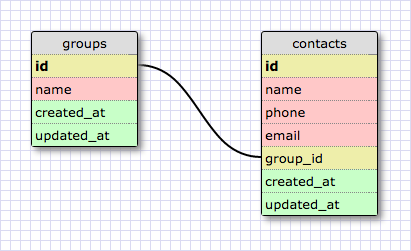

# Associating Groups and Contacts

## Summary
We're going to be working with two classes:  `Group` and `Contact`.  Each class is backed by our database.  The classes are provided with behaviors for persisting themselves in the database.  We can save new groups and contacts in our database, we can pull records out of the database, we can update records in the database, etc.

However, the classes are independent of each other.  We can't ask a group which contacts it has.  And conversely, we can't ask a contact to which group it belongs.

At least not yet.  That's the behavior we're going to add in this challenge.  We're going to write methods that allow us to associate groups and contacts with each other.  For example, we'll be able tell a group that it has a new contact and tell a contact that it belongs to a specific group.


## Releases
### Pre-release: Setup the Database
In order for our `Group` and `Contact` classes to work properly, we need a database with a `groups` table and a `contacts` table.  The file `setup.rb` will create this database for us; all we need to do is run the file:

```
$ ruby setup.rb
```

*Note:* If we somehow break our database, we can rerun this file to remove the old database file and create a new one.  We'll lose any data in the database, but it is an option.


### Release 0: A Contact Belongs to a Group

*Figure 1*. Database schema visualization.

The schema for the database we created is represented in Figure 1.  What type of relationship exists between groups and contacts?

It's a one-to-many association.  A group has many contacts.  A contact belongs to one group.  So, how do we determine the group to which a contact belongs?  `contacts.group_id` is a foreign key field whose value points to a group, so we take the contact's `group_id` value and use it to select the group with that id.

What we want to do in this release is to model a contact belonging to a group in ruby.  We're going to update our `Contact` model with behaviors related to belonging to a group.  Tests for these behaviors are written in the `"belonging to a group"` example group in `spec/contact_spec.rb`.  Update the `Contact` class to pass the tests.

When we're done, we'll have code that we can use as seen in Figure 2. To follow along in IRB, load the `config.rb`, `group.rb`, and `contact.rb` files.

```ruby
nighthawks = Group.new("name" => "Nighthawks")
nighthawks.save
nighthawks.id
# => 1

sammy = Contact.new("name" => "Sammy")
sammy.group_id
# => nil
sammy.group
# => nil

sammy.group = nighthawks
sammy.group_id
# => 1
sammy.group
# => #<Group:0x007f8aa9201be8 @id=1, @name="Nighthawks", @created_at=#<DateTime: 2016-06-10T15:36:59+00:00 ((2457550j,56219s,0n),+0s,2299161j)>, @updated_at=#<DateTime: 2016-06-10T15:36:59+00:00 ((2457550j,56219s,0n),+0s,2299161j)>>
```
*Figure 2*.  Assigning a contact to a group.
